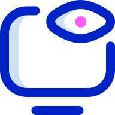

<!-- PROJECT SHIELDS -->
<!--
*** I'm using markdown "reference style" links for readability.
*** Reference links are enclosed in brackets [ ] instead of parentheses ( ).
*** See the bottom of this document for the declaration of the reference variables
*** for contributors-url, forks-url, etc. This is an optional, concise syntax you may use.
*** https://www.markdownguide.org/basic-syntax/#reference-style-links
-->
[![Contributors][contributors-shield]][contributors-url]
[![Forks][forks-shield]][forks-url]
[![Stargazers][stars-shield]][stars-url]
[![Issues][issues-shield]][issues-url]
[![MIT License][license-shield]][license-url]
[![LinkedIn][linkedin-shield]][linkedin-url]


<!-- PROJECT LOGO -->
<br />
<p align="center">
  <a href="https://github.com/raulmarindev/where-to-watch">
    
  </a>

  <h3 align="center">WhereToWatch</h3>

  <p align="center">
    Search where you can watch your favorite movie or tv show. Platforms supported by the api: Netflix, Apple TV and Prime Video.
    <br />
    <a href="https://github.com/raulmarindev/where-to-watch"><strong>Explore the docs »</strong></a>
    <br />
    <br />
    <a href="https://github.com/raulmarindev/where-to-watch">View Demo</a>
    ·
    <a href="https://github.com/raulmarindev/where-to-watch/issues">Report Bug</a>
    ·
    <a href="https://github.com/raulmarindev/where-to-watch/issues">Request Feature</a>
  </p>
</p>


<!-- TABLE OF CONTENTS -->
## Table of Contents

* [About the Project](#about-the-project)
  * [Built With](#built-with)
* [Getting Started](#getting-started)
  * [Prerequisites](#prerequisites)
  * [Installation](#installation)
* [Usage](#usage)
* [Roadmap](#roadmap)
* [Contributing](#contributing)
* [License](#license)
* [Contact](#contact)
* [Acknowledgements](#acknowledgements)


<!-- ABOUT THE PROJECT -->
## About The Project

[![Product Name Screen Shot][product-screenshot]](public/screenshot1.png)

This React app connects itself to the [utelly API](https://rapidapi.com/utelly/api/utelly) and allows the user to retrieve where it's possible to watch that great movie or TV show your friend told you is a must watch. Right now only US is supported.

### Built With
This section should list any major frameworks that you built your project using. Leave any add-ons/plugins for the acknowledgements section. Here are a few examples.
* [React](https://reactjs.org/)
* [create-react-app](https://github.com/facebook/create-react-app)
* [react-bootstrap](https://react-bootstrap.netlify.app/)
* [TypeScript](https://www.typescriptlang.org/)
* [axios](https://github.com/axios/axios)
* [Utelly API](https://rapidapi.com/utelly/api/utelly/)
* [Risk3sixty-Labs/geoapi](https://github.com/Risk3sixty-Labs/geoapi)


<!-- GETTING STARTED -->
## Getting Started

This is an example of how you may give instructions on setting up your project locally.
To get a local copy up and running follow these simple example steps.

### Prerequisites

You need to install the following elements:
* npm
```sh
npm install npm@latest -g
```
* yarn
```sh
npm install yarn -g
```

### Installation

1. Get a free API Key at [https://rapidapi.com/utelly/api/utelly](https://rapidapi.com/utelly/api/utelly)
2. Clone the repo
```sh
git clone https://github.com/raulmarindev/where-to-watch.git
```
3. Install NPM packages
```sh
yarn install
```
4. Enter your API Key, Host and Endpoint in your `.env` file
```JS
REACT_APP_RAPIDAPI_HOST=utelly-tv-shows-and-movies-availability-v1.p.rapidapi.com
REACT_APP_RAPIDAPI_ENDPOINT=https://utelly-tv-shows-and-movies-availability-v1.p.rapidapi.com
REACT_APP_RAPIDAPI_KEY=<YOUR_API_KEY>
```

<!-- USAGE EXAMPLES -->
## Usage

This project was bootstrapped with [Create React App](https://github.com/facebook/create-react-app).

## Available Scripts

In the project directory, you can run:

### `yarn start`

Runs the app in the development mode.<br />
Open [http://localhost:3000](http://localhost:3000) to view it in the browser.

The page will reload if you make edits.<br />
You will also see any lint errors in the console.

### `yarn test`

Launches the test runner in the interactive watch mode.<br />
See the section about [running tests](https://facebook.github.io/create-react-app/docs/running-tests) for more information.

### `yarn build`

Builds the app for production to the `build` folder.<br />
It correctly bundles React in production mode and optimizes the build for the best performance.

The build is minified and the filenames include the hashes.<br />
Your app is ready to be deployed!

See the section about [deployment](https://facebook.github.io/create-react-app/docs/deployment) for more information.

### `yarn eject`

**Note: this is a one-way operation. Once you `eject`, you can’t go back!**

If you aren’t satisfied with the build tool and configuration choices, you can `eject` at any time. This command will remove the single build dependency from your project.

Instead, it will copy all the configuration files and the transitive dependencies (webpack, Babel, ESLint, etc) right into your project so you have full control over them. All of the commands except `eject` will still work, but they will point to the copied scripts so you can tweak them. At this point you’re on your own.

You don’t have to ever use `eject`. The curated feature set is suitable for small and middle deployments, and you shouldn’t feel obligated to use this feature. However we understand that this tool wouldn’t be useful if you couldn’t customize it when you are ready for it.

## Learn More

You can learn more in the [Create React App documentation](https://facebook.github.io/create-react-app/docs/getting-started).

To learn React, check out the [React documentation](https://reactjs.org/).


<!-- ROADMAP -->
## Roadmap

See the [open issues](https://github.com/raulmarindev/where-to-watch/issues) for a list of proposed features (and known issues).


<!-- CONTRIBUTING -->
## Contributing

Contributions are what make the open source community such an amazing place to be learn, inspire, and create. Any contributions you make are **greatly appreciated**.

1. Fork the Project
2. Create your Feature Branch (`git checkout -b feature/AmazingFeature`)
3. Commit your Changes (`git commit -m 'Add some AmazingFeature'`)
4. Push to the Branch (`git push origin feature/AmazingFeature`)
5. Open a Pull Request


<!-- LICENSE -->
## License

Distributed under the MIT License. See `LICENSE` for more information.


<!-- CONTACT -->
## Contact

Your Name - [@raulmarindev](https://twitter.com/raulmarindev) - raulmarindev@protonmail.com

Project Link: [https://github.com/raulmarindev/where-to-watch](https://github.com/raulmarindev/where-to-watch)


<!-- ACKNOWLEDGEMENTS -->
## Acknowledgements
* [Img Shields](https://shields.io)
* [Choose an Open Source License](https://choosealicense.com)
* [Vercel](https://vercel.com/)
* [Best-README-Template](https://github.com/othneildrew/Best-README-Template/blob/master/README.md)
* [Webpack](https://webpack.js.org/)
* [Bootstrap](https://getbootstrap.com/)


<!-- MARKDOWN LINKS & IMAGES -->
<!-- https://www.markdownguide.org/basic-syntax/#reference-style-links -->
[contributors-shield]: https://img.shields.io/github/contributors/raulmarindev/where-to-watch.svg?style=flat-square
[contributors-url]: https://github.com/raulmarindev/where-to-watch/graphs/contributors
[forks-shield]: https://img.shields.io/github/forks/raulmarindev/where-to-watch.svg?style=flat-square
[forks-url]: https://github.com/raulmarindev/where-to-watch/network/members
[stars-shield]: https://img.shields.io/github/stars/raulmarindev/where-to-watch.svg?style=flat-square
[stars-url]: https://github.com/raulmarindev/where-to-watch/stargazers
[issues-shield]: https://img.shields.io/github/issues/raulmarindev/where-to-watch.svg?style=flat-square
[issues-url]: https://github.com/raulmarindev/where-to-watch/issues
[license-shield]: https://img.shields.io/github/license/raulmarindev/where-to-watch.svg?style=flat-square
[license-url]: https://github.com/raulmarindev/where-to-watch/blob/master/LICENSE.txt
[linkedin-shield]: https://img.shields.io/badge/-LinkedIn-black.svg?style=flat-square&logo=linkedin&colorB=555
[linkedin-url]: https://linkedin.com/in/raulmarindev
[product-screenshot]: public/screenshot.png
